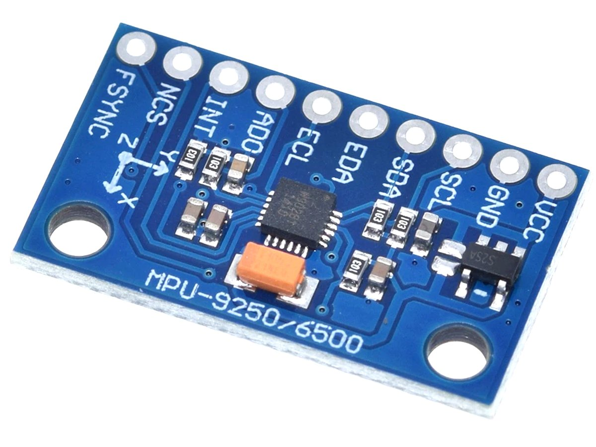

# Device Driver para el acelerómetro del GY-521 con controlador MPU-6500

El propósito de este driver es facilitar la lectura valores del acelerómetro a través de la interfaz I²C y operar con el acelerómetro en diferentes modos de alimentación.

Este driver está diseñado específicamente para el modelo MPU-6500. Otros sensores pueden requerir configuraciones distintas.
No se implementa  el uso del giroscopio ni del sensor de temperatura del módulo GY-521.

## Estructura del driver

```
GY521_MPU6500/
├── Inc/
│   ├── GY521.h         # Interfaz de alto nivel del driver
│   └── GY521_port.h    # Interfaz de bajo nivel (acceso al hardware)
├── Src/
│   ├── GY521.c         # Implementación de funciones de alto nivel
│   └── GY521_port.c    # Implementación de funciones específicas del hardware y comunicación por I²C
└── docs/               # Documentación sobre el driver
```

## Funcionalidades principales

Este driver permite:

- Inicializar el sensor MPU-6500 en modos de bajo consumo o bajo ruido.
- Leer valores crudos del acelerómetro en los tres ejes (X, Y, Z).
- Calibrar automáticamente el offset en cada eje al iniciar.
- Operar con lectura optimizada de registros (lectura de 6 bytes contiguos).

**Nota:** Este driver no implementa la lectura del giroscopio ni del sensor de temperatura del módulo GY-521.

## Interfaz de alto nivel
Las funciones y estructuras disponibles para el usuario están definidas en `GY521.h`.

Este módulo utiliza una estructura `gyro_t` que encapsula los datos necesarios para operar el acelerómetro del módulo GY-521:
```c
typedef struct{
   I2C_HandleTypeDef * hi2c;
   uint8_t devAddress;
   int16_t calX;
   int16_t calY;
   int16_t calZ;
} gyro_t;
```
Esta estructura permite definir qué periférico I2C utilizar y con qué dirección se encuentra conectado el dispositivo. Además, mantiene internamente los valores de calibración de cada eje.

Las funciones disponibles son las siguientes:

| Función | Descripción |
| ------- | ----------- |
| gyroInit() | Inicializa el módulo GY-521 en un modo de operación seleccionado, verifica la conexión y realiza la calibración |
| gyroReadAccel() | Lee las aceleraciones actuales en los tres ejes X, Y y Z, aplicando la calibración previa automáticamente |

**NOTAS:**
- La calibración inicial se realiza al momento de llamar a `gyroInit()`, y se basa en la posición actual del dispositivo.
- La función `gyroReadAccel()` entrega valores crudos (int16_t) que corresponden a la aceleración medida en los tres ejes, donde ±1G corresponde a ±16384 (modo ±2G del dispositivo).

## Modos de alimentación
El driver permite seleccionar entre dos modos de alimentación del acelerómetro durante la inicialización, definidos mediante el parámetro `mode`. Ambos modos están optimizados para diferentes necesidades de consumo y precisión de medición, utilizando configuraciones específicas del MPU-6500:

### Low-Power Accelerometer Mode (LOW_POWER_ACC_MODE)
Este modo utiliza la capacidad del MPU-6500 para operar el acelerómetro en un estado de bajo consumo mediante ciclos de activación periódicos. Es ideal para aplicaciones donde se requiere un monitoreo esporádico del movimiento con un consumo mínimo de energía.

Configuración interna:
- CYCLE = 1: habilita el muestreo cíclico.
- SLEEP = 0: desactiva el modo de suspensión general.
- TEMP_DIS = 1: desactiva el sensor de temperatura.
- DIS_XG, DIS_YG, DIS_ZG = 1: desactiva el giróscopo en todos los ejes.
- LP_WAKE_CTRL = 3: define una frecuencia de muestreo de 40 Hz (tiempo entre muestras: 25ms)

Características:
- Acelerómetro: activación cíclica (duty-cycled).
- Giroscopio: desactivado.
- Consumo: muy bajo.
- Precisión: limitada por el intervalo de muestreo.

### Low-Noise Accelerometer Mode (LOW_NOISE_ACC_MODE)
Este modo está diseñado para aplicaciones donde se requiere una lectura precisa y continua del acelerómetro, con bajo nivel de ruido y sin comprometer la calidad de la señal. A diferencia del modo de bajo consumo, en este caso el acelerómetro permanece encendido permanentemente y se configura un filtro digital para minimizar el ruido de alta frecuencia.

Configuración interna:
- SLEEP = 0: dispositivo completamente activo.
- CYCLE = 0: desactiva el modo de muestreo cíclico.
- TEMP_DIS = 1: desactiva el sensor de temperatura.
- DIS_XG, DIS_YG, DIS_ZG = 1: desactiva el giróscopo en todos los ejes.
- ACCEL_FCHOICE_B = 0: habilita el filtro digital de pasa-bajos.
- A_DLPF_CFG = 001: configura la frecuencia de corte del filtro a 92 Hz (ideal para eliminar ruido de alta frecuencia sin perder información útil).
- SMPLRT_DIV = 0: define una frecuencia de 1 kHz (tiempo entre muestras: 1ms).

Características:
- Acelerómetro: activo en todo momento.
- Giroscopio: desactivado (modo standby en los tres ejes).
- Filtro digital: habilitado, con frecuencia de corte a 92 Hz.
- Consumo: moderado.
- Precisión: alta, con bajo nivel de ruido.

## Ejemplo de uso básico

Ejemplo de inicialización y lectura de aceleración:
```c
gyro_t myGyro;
int16_t accX, accY, accZ;

gyroStatus_t status = gyroInit(&myGyro, &hi2c1, 0xD0, LOW_POWER_ACC_MODE);

if (status == GYRO_OK) {
   gyroReadAccel(&myGyro, &accX, &accY, &accZ);
   // accX, accY y accZ contienen los valores calibrados
}
```

## Información general sobre el acelerometro y giroscopio de 6 ejes GY-521 con controlador MPU-6500.

[Datasheet del controlador MPU-6500](./docs/PS-MPU-6500A-01-v1.3.pdf)

[Mapa de registros del MPU-6500](./docs/MPU-6500-Register-Map2.pdf)

Imágen del módulo:



Los siguientes son los modos de alimentación posibles para el MPU-6500 (según su datasheet). 

| Mode  | Name                          | Gyro      | Accel         | DMP       |
| ----  | ----------------------------- | --------- | ------------- | --------- | 
| 1     | Sleep Mode                    | Off       | Off           | Off       | 
| 2     | Standby Mode                  | Drive On  | Off           | Off       |  
| 3     | Low-Power Accelerometer Mode  | Off       | Duty-Cycled   | Off       | 
| 4     | Low-Noise Accelerometer Mode  | Off       | On            | Off       | 
| 5     | Gyroscope Mode                | On        | Off           | On or Off | 
| 6     | 6-Axis Mode                   | On        | On            | On or Off |  

Frecuencia de muestreo en el modo 3: 

Configurable mediante el campo `LP_WAKE_CTRL`, que define cada cuánto tiempo se activa el acelerómetro para tomar una medición:

| LP_WAKE_CTRL  | Frequencia de muestreo | 
| ------------  | ----------------- | 
| 0             | 1.25 Hz           | 
| 1             | 5 Hz              | 
| 2             | 20 Hz             | 
| 3             | 40 Hz             |

Filtros de pasa-bajos en el modo 4:

| ACCEL_FCHOICE_B | A_DLPF_CFG | Bandwidth (Hz) | Delay (ms) | Noise Density (µg/√Hz)  | Rate (kHz) |
|-----------------|------------|----------------|------------|-------------------------|------------|
| 1               | X          | 113 K          | 0.75       | 220                     | 4
| 0               | 0          | 460            | 1.94       | 220                     | 1          |
| 0               | 1          | 184            | 5.80       | 220                     | 1          |
| 0               | 2          | 92             | 7.80       | 220                     | 1          |
| 0               | 3          | 41             | 11.80      | 220                     | 1          |
| 0               | 4          | 20             | 19.80      | 220                     | 1          |
| 0               | 5          | 10             | 35.70      | 220                     | 1          |
| 0               | 6          | 5              | 66.96      | 220                     | 1          |
| 0               | 7          | 460            | 1.94       | 220                     | 1          |

### Registros

Algunos registros útiles del MPU-6500:

| Nombre del Registro   | Dirección (Hexa)  | Descripción |
| --------------------- | ----------------- | ----------- |
| WHO_AM_I              | 0x75              | Identificador del dispositivo. Devuelve un valor fijo que permite verificar la presencia del sensor. |
| CONFIG                | 0x1A              | Configura el filtro de paso bajo digital para el giroscopio y controla la sincronización externa. |
| GYRO_CONFIG           | 0x1B              | Configura la escala de sensibilidad del giroscopio y activa opciones de auto-test. |
| ACCEL_CONFIG          | 0x1C              | Configura la escala de sensibilidad del acelerómetro y activa opciones de auto-test. |
| ACCEL_CONFIG2         | 0x1D              | Configura el filtro de paso bajo del acelerómetro y selecciona la frecuencia de corte para reducir el ruido. |
| PWR_MGMT_1            | 0x6B              | Control principal de energía: permite activar o desactivar el modo de sueño, seleccionar el reloj, y activar el modo cíclico. |
| PWR_MGMT_2            | 0x6C              | Permite habilitar o deshabilitar individualmente los ejes del giroscopio y acelerómetro para reducir el consumo. |
| ACCEL_XOUT_H          | 0x3B              | Byte alto de la lectura del eje X del acelerómetro. |
| ACCEL_XOUT_L          | 0x3C              | Byte bajo de la lectura del eje X del acelerómetro. |
| ACCEL_YOUT_H          | 0x3D              | Byte alto de la lectura del eje Y del acelerómetro. |
| ACCEL_YOUT_L          | 0x3E              | Byte bajo de la lectura del eje Y del acelerómetro. |
| ACCEL_ZOUT_H          | 0x3F              | Byte alto de la lectura del eje Z del acelerómetro. |
| ACCEL_ZOUT_L          | 0x40              | Byte bajo de la lectura del eje Z del acelerómetro. |


### Información extra del MPU-6500.

*The  slave  address  of  the  MPU-6500  is  b110100X  which  is  7  bits  long. The  LSB  bit  of  the  7  bit  address  is determined by the logic level on pin AD0. The address of the divice should be b1101000  if pin AD0 is logic low.*

The contents of WHO_AM_I is an 8-bit device ID. The default value of the register is 0x70 for MPU-6500. This is different from the I2C address of the device as seen on the slave I2C controller by the applications processor. The I2C address of the MPU-6500 is 0x68 or 0x69 depending upon the value driven on AD0 pin.

SENSOR DATA REGISTERS: The sensor data registers contain the latest gyro, accelerometer, auxiliary sensor, and temperature measurement 
data. They are read-only registers, and are accessed via the serial interface. Data from these registers may be read anytime. s

The (max) accelerometer output rate is 1kHz. This means that for a Sample Rate greater than 1kHz, the same accelerometer sample may be output to the FIFO, DMP, and sensor registers more than once. 