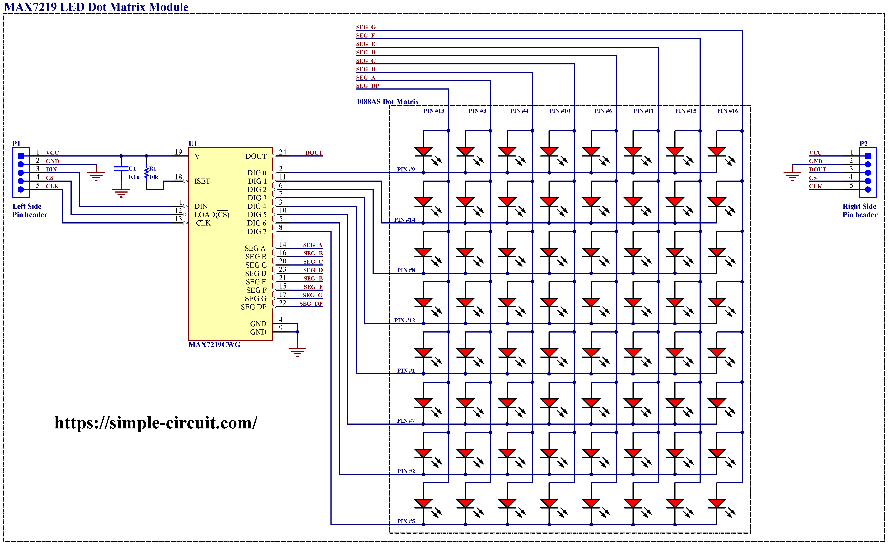

# Device Driver para Matrix de LEDs de 8x8 con controlador MAX7219

El propósito de este driver es **abstraer la comunicación y el manejo de la matriz de LEDs**, permitiendo al usuario interactuar con el display de forma sencilla y segura mediante funciones claras y desacopladas del hardware específico.

El diseño sigue una **arquitectura modular por capas**, lo que facilita su reutilización en distintos proyectos y plataformas.

El driver fue diseñado para manejar una sola matriz y no puede manejar múltiples matrices en cascada sin antes extender la lógica de transmisión SPI.
Este driver no admite operaciones de lectura, por lo que se compone únicamente de operaciones de escritura o `Comandos` enviados a la matriz de LEDs para su control.

## Estructura del driver

```
ledMatrix_MAX7219/
 ├── Inc/
 │ ├── ledMatrix.h      # Interfaz de alto nivel del driver
 │ └── ledMatrix_port.h # Interfaz de bajo nivel (acceso al hardware)
 ├── Src/
 │ ├── ledMatrix.c      # Implementación de funciones de alto nivel
 │ └── ledMatrix_port.c # Implementación de funciones específicas del hardware y comunicación por SPI
 └── docs/              # Documentación sobre el driver
```

## Funcionalidades principales

- Inicialización del dispositivo MAX7219
- Encendido y apagado del display (modo SHUTDOWN)
- Control de brillo (tres niveles: bajo, medio, alto)
- Limpieza de pantalla
- Representación de un buffer de pantalla en la matriz (renderizado)
- Aislamiento del control de pines y comunicación SPI en funciones de bajo nivel (`ledMatrix_port.c`)

## Interfaz de alto nivel

Las funciones y estructuras disponibles para el usuario están definidas en `ledMatrix.h`.

Este módulo utiliza una estructura `ledMatrix_t` que encapsula los datos necesarios para operar la matriz:
```c
typedef struct{
   GPIO_TypeDef * csPort;
   uint16_t csPin;
   SPI_HandleTypeDef * hSpi;
} ledMatrix_t;
```
Esta estructura permite definir con claridad qué SPI usar y qué pin se utilizará como **CS (chip select)** para habilitar el dispositivo.

Las funciones disponibles son las siguientes:

| Función | Descripción |
| ------- | ----------- |
| ledMatrixInit() | Inicializa la matriz configurando el MAX7219 |
| ledMatrixShutdown() | Habilita o deshabilita el modo SHUTDOWN |
| ledMatrixClear() | Limpia el display (apagando todos los LEDs) |
| ledMatrixRender() | Renderiza un buffer pantalla de 8 bytes sobre la matriz |
| ledMatrixSetIntensity() | Ajusta el brillo de los LEDs de la matriz |

**NOTA:** La función `ledMatrixRender()` espera un puntero a un arreglo de 8 bytes, donde cada byte representa una columna del display.

## Ejemplo de uso básico

Ejemplo de inicialización y renderizado:
```c
ledMatrix_t myMatrix;
uint8_t displayBuffer[8] = {0x10,0x18,0x1C,0xFE,0xFE,0x1C,0x18,0x10}; // Flecha hacia arriba

ledMatrixInit(&myMatrix, &hspi2, GPIOB, GPIO_PIN_6);
ledMatrixSetIntensity(&myMatrix, INTENSITY_MEDIUM);
ledMatrixRender(&myMatrix, displayBuffer);
```

## Información general sobre la Matriz de LEDs de 8x8 con controlador MAX7219.

[Datasheet del controlador MAX7219](./docs/max7219-max7221.pdf)

Esquema de conexión del módulo:



El MAX7219 es un circuito integrado diseñado para el control de displays de LEDs, permitiendo gestionar hasta 64 LEDs mediante una interfaz serial compatible con SPI. Su arquitectura le permite operar con distintos tipos de arreglos, como matrices de LEDs de 8x8, displays de 7 segmentos de hasta 8 dígitos (originalmente diseñado para este fin) u otras configuraciones basadas en LEDs.

Este circuito integrado posee algunas características de utilidad como el control de la intensidad del display, un modo para testear el funcionamiento de los LEDs, un decodificador para BCD (Binary Coded Decimal), salidas compatibles para conexión en formato Daisy-Chain, y una pequeña memoria RAM interna con 8 registros de 8 bits donde guarda la información de cada dígito o grupo de 8 LEDs (filas o columnas) de la matriz.

Este integrado funciona como un multiplexor de filas o columnas de la matrix (según su conexión y orientanción). El esquematico de conexión es el siguiente:
[](./docs/max7219-dot-matrix-circuit-schematic.png)

### Registros e Instrucciones 

El MAX7219 tiene un conjunto de registros de dígitos y de control a los que se les puede enviar comandos a través de la interfaz SPI. Cada comando se envía con 16 bits:
- Los primeros 8 bits (D15-D8) representan la dirección del registro que se desea escribir.
- Los siguientes 8 bits (D7-D0) contienen el dato a escribir en ese registro.

| Nombre del Registro   | Dirección (Hexa)  | Descripción | 
| --------------------- | ----------------- | ----------- | 
| No-op                 | 0xX0              | Utilizado para manejar múltiples drivers en daisy-chain. El comando No-op (0xX0) seguido de cualquier valor (0xXX) permite no enviar ningún cambio al driver. | 
| Dígitos 0 a 7         | 0xX1 a 0xX8       | Registros en RAM para programar los dígitos. | 
| Modo de decodificación | 0xX9             | Habilita el modo de decodificación BCD para cada dígito. Cada bit de dato enviado a este registro corresponde a un dígito.  | 
| Intensidad del display | 0xXA             | Ajusta el brillo de los LEDs  mediante un PWM interno en 16 niveles (0xX0 a 0xXF). | 
| Límite de dígitos a escanear              | 0xXB | Setea el número de dígitos a mostrar de 1 a 8 (0xX0 a 0xX7). | 
| Shutdown              | 0xXC              | Controla el encendido/apagado del chip (0x00 = OFF, 0x01 = ON). Cuando el IC está en modo Shutdown ahorrará energía, pero aún puede ser programado. | 
| Test de Display       | 0xXF              | Operación en modo Test (todos los LEDs encendidos) o modo normal. | 


