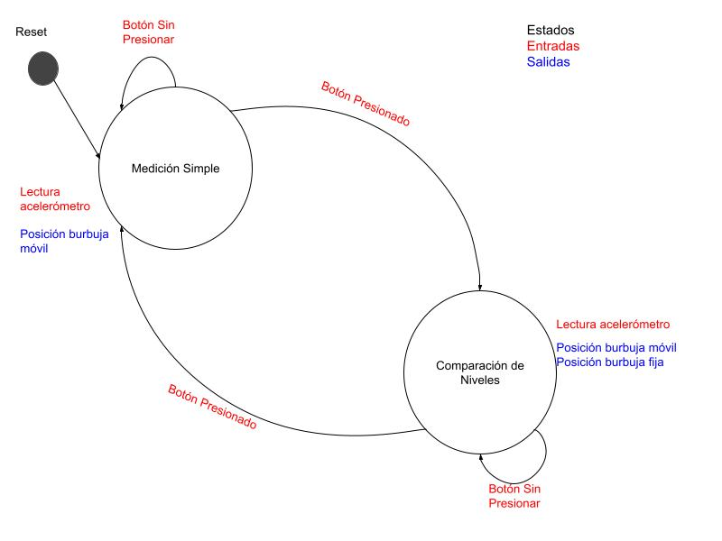

# Nivel de Superficies Digital

Este proyecto fue creado con el objetivo de funcionar como TP final para las materias "Protocolos de Comunicación en Sistemas Embebidos" y "Programación de Microcontroladores" de la **Carrera de Especialización en Sistemas Embebidos** de la UBA.

El proyecto consiste en un **Nivel de Superficies Digital** que simula el funcionamiento del clásico *nivel de burbuja* utilizado en carpintería, pero implementado digitalmente. Utiliza un acelerómetro MPU-6500 para medir la inclinación de una superficie en los ejes X e Y, representando el desplazamiento de la burbuja en una matriz de LEDs 8x8. 
Se modeló la aplicación como una máquina de estado finito cuyos estados se corresponden a los modos de funcionamiento: *medición simple del nivel de una superficie* o *comparador de superficies*. Este segundo modo permite almacenar una medición y compararla con otra en simultáneo. 

El sistema está basado en una placa STM32 NUCLEO-F446RE, y emplea los siguientes protocolos de comunicación para comunicarse con los módulos de entradas y salidas: I²C para el acelerómetro, SPI para la matriz de LEDs y UART para mostrar los valores de entrada y salida por el monitor serial.

## Estructura del Proyecto

La aplicación del nivel de superficies se encuentra desarrollada en el archivo `main.c`. La documentación del proyecto fue generada con *Doxygen*, el archivo `Doxyfile` y la documentación generada en `html` se encuentran en la carpeta `docs/` ubicada a nivel de proyecto.

Esta aplicación utiliza varios drivers específicos desarrollados para facilitar el uso de retardos no bloqueantes, el debounce del botón utilizado para cambiar de modo y el envío de datos mediante la UART. Estos drivers específicos fueron desarrollados como parte de las prácticas de la materia *Programación de Microcontroladores* y mejorados o adaptados para este proyecto, se encuentran ubicados en la carpeta [API/](./Drivers/API/README.md).

Para la configuración y comunicación con los módulos externos seleccionados para el proyecto (el acelerómetro y el display de LEDs) se desarrollaron los *Device Drivers* correspondientes que se encuentran ubicados respectivamente en las carpetas `ledMatrix_MAX7219/` y `GY521_MPU6500/`, acompañados de su respectiva documentación.

```
TP_nivel_burbuja/                                                
├── README.md                          # README del proyecto (a nivel aplicación) 
├── docs/                              
|    ├── Doxyfile                      # Doxyfile del proyecto
|    └── html/                         # Documentación del proyecto (en HTML) generada con Doxygen
├── Core/                              
|    ├── Inc/                            
|    |    ├── main.h                             
|    |    └── …                          
|    ├── Src/                            
|    |    ├── main.c                   # Archivo principal de la aplicación         
|    |    └── …                        
└── Drivers/                            
     ├── API/                          # Drivers Específicos
     |    ├── README.md                # README de los drivers específicos         
     |    ├── Inc/                     
     |    |    ├── API_delay.h         # Proporciona funciones para retardos no bloqueantes                 
     |    |    ├── API_debounce.h      # Implementa una máquina de estados para el debounce de botón                   
     |    |    └── API_uart.h          # Interfaz para la configuración y uso de UART2               
     |    └── Src/                        
     |         ├── API_delay.c         # Implementación de las funciones de retardo no bloqueante                 
     |         ├── API_debounce.c      # Implementación de la máquina de estados de debounce                   
     |         └── API_uart.c          # Implementación de las funciones de UART2    
     |                  
     ├── ledMatrix_MAX7219/            # Device Driver para Matrix de LEDs de 8x8 con controlador MAX7219           
     |    ├── README.md                # README del driver       
     |    ├── docs/                    # Documentación sobre el driver
     |    ├── Inc/                       
     |    |    ├── ledMatrix.h         # Interfaz de alto nivel del driver                           
     |    |    └── ledMatrix_port.h    # Interfaz de bajo nivel (acceso al hardware)                     
     |    └── Src/                          
     |         ├── ledMatrix.c         # Implementación de funciones de alto nivel                
     |         └── ledMatrix_port.c    # Implementación de funciones específicas del hardware y comunicación por SPI   
     |                 
     └── GY521_MPU6500/                # Device Driver para el acelerómetro del GY-521 con controlador MPU-6500         
          ├── README.md                # README del driver       
          ├── docs/                    # Documentación sobre el driver     
          ├── Inc/                       
          |    ├── GY521.h             # Interfaz de alto nivel del driver                       
          |    └── GY521_port.h        # Interfaz de bajo nivel (acceso al hardware)                 
          └── Src/                          
               ├── GY521.c             # Implementación de funciones de alto nivel               
               └── GY521_port.c        # Implementación de funciones específicas del hardware y comunicación por I²C                 
```

## Máquina de Estados Finitos en la aplicación

El comportamiento de la aplicación es el siguiente:
- el modo normal de funcionamiento del dispositivo es una medición simple del nivel de la superficie, mediante el cual se detecta la inclinación del módulo mediante las lecturas del acelerómetro y se grafica una "burbuja" en el display de LEDs que representa dicha inclinación
- al presionar un botón, el nivel actual es "fijado" en la pantalla (el led se fija en la posición actual) y una segunda "burbuja" acompaña el movimiento
- cuando ambos niveles se encuentran alineados se veran ambas "burbujas" en la misma posición (un solo led encendido)
- para salir del modo de comparación se presiona nuevamente el botón y se retorna al modo normal de medición simple.

Para modelar este comportamiento se utilizó el modelo de **MEF de Mealy**, en el que las salidas dependen del *estado actual* y de *las entradas*. Para ello se definen los estados de la siguiente forma:

- MEDICIÓN_SIMPLE: En este estado, la aplicación funciona como medidor del nivel de la superficie actual.
- COMPARACIÓN_DE_NIVELES: En este estado la aplicación permite comparar el nivel de la superficie actual contra un nivel previo fijado.

Las entradas son las siguientes:

- Lecturas de acelerómetro: Las lecturas obtenidas de los ejes X e Y del acelerómetro.
- Pulsación del botón: Cada pulsación del botón será una entrada para la aplicación.

Las salidas son las siguientes:

- Posición de la burbuja móvil en la pantalla de LEDs.
- Prescencia y posición de la burbuja fija en la pantalla de LEDs.




## Funciones Principales

- bubbleInit(): Inicializa la MEF y los periféricos.
- bubbleUpdate(): Actualiza el estado de la burbuja, incluyendo la lectura del acelerómetro y el procesamiento del botón.
- drawMatrix(): Genera el buffer de pantalla para renderizar en la matriz de LEDs.
- mapAccelToPosition(): Mapea los valores del acelerómetro a las coordenadas de la matriz.
- sendOutputsByUart(): Envía los valores de entrada y salida por la UART.
- saveCurrentLevel(): Guarda la posición actual de la burbuja para utilizarla para la comparación.
- deleteSavedLevel(): Borra la posición guardada de la burbuja fija.

## Perfiféricos utilizados

### Módulo I²C:
Utilizado para la comunicación con el GY-521 (MPU-6500). Se configuró de la siguiente manera:
- Velocidad del reloj: 100KHz
- Largo de direcciones: 7 bits
- Pin SCL: Puerto B pin 8
- Pin SDA: Puerto B pin 9
- Interrupciones: deshabilitadas.
- DMA: deshabilitado.

### Módulo SPI:
Utilizado para la comunicación con la matriz de LEDs 8x8 (MAX7219). Se configuró de la siguiente manera:
- Modo: simplex, sólo MOSI.
- Tamaño de transmisión: 8 bits
- Endianness: MSB first
- Polaridad del Reloj (CPOL): 1 (HIGH)
- Fase del reloj (CPHA): 0 (leading edge)
- Baud Rate: 1.3125 Mbits/s 
- Pin SCK: Puerto A pn 5
- Pin MOSI: Puerto A pin 7
- Pin CS: Puerto B pin 6
- Interrupciones: deshabilitadas.
- DMA: deshabilitado.

### Módulo UART:
Para mostrar los valores del acelerómetro y la posición de la burbuja en la matriz por el monitor serial. Se configuró de la siguiente manera:
- Interfaz: UART2
- Baud Rate: 115200 bps
- Tamaño del frame: 8 bits
- Paridad: No
- Bits de stop: 1
- Control de flujo por hardware: deshabilitado.
- Interrupciones: deshabilitadas.
- DMA: deshabilitado.

### Timers:
Para gestionar el tiempo entre lecturas del acelerómetro y actualizar la matriz. Se utilizó el *SysTick*.

### GPIO:
Para cambiar de modo de trabajo en la aplicación se utilizó el botón 1. Este botón se encuentra incorporado en la placa NUCLEO y se encuentra conectado al *puerto C pin 13*.

## Drivers implementados
### GY521_MPU6500 (I2C)
[Link a la documentación del driver](./Drivers/GY521_MPU6500/README.md)

Este Device Driver es un Polled Driver que permite configurar y controlar el acelerómetro del módulo comercial GY-521 que utiliza el controlador MPU-6500. 

El propósito de este driver es facilitar la lectura valores del acelerómetro a través de la interfaz I²C y operar con el acelerómetro en diferentes modos de alimentación. 

El diseño del driver sigue una arquitectura modular por capas, donde la capa superior o de alto nivel funciona como abstracción del hardware, presentando una interfaz más amigable hacia el usuario. Entre las funcionalidades presentadas mediante la interfaz al usuario se encuentran:
- Inicializar el sensor en modos de bajo consumo o bajo ruido.
- Leer las mediciones del acelerómetro en los tres ejes (X, Y, Z) mediante una función sencilla.
- Calibrar el offset en cada eje al inicializar el dispositivo y ajustar las mediciones realizadas con dichos valores.

La capa inferior o de bajo nivel de este driver concentra la comunicación con el hardware mediante el protocolo I²C, utilizando las funciones que provee la HAL de STM32. Entre las funcionalidades de la capa de bajo nivel se encuentran:
- Lectura de 1 hasta 14 registros contiguos del controlador MPU-6500.
- Escritura de un registro específico del controlador MPU-6500.
- Posibilidad de saber si las operaciones se realizaron exitosamente o con errores, mediante los valores de retorno de las funciones.

Este driver tiene el siguiente alcance y limitaciones:
- Se encuentra diseñado específicamente para el acelerómetro del modelo de controlador MPU-6500. Otros sensores pueden requerir configuraciones distintas y no se recomienda el uso de este driver.
- No se implementa  el uso del giroscopio ni del sensor de temperatura presentes en el controlador MPU-6500.
- Se encuentran implementados dos modos de operación: Low-Power Accelerator Mode y Low-Noise Accelerator Mode tal como se describen en el datasheet del MPU-6500, sin uso del sensor de temperatura. No se encuentran implementados los modos descritos como Sleep Mode, Standby Mode, Gyroscope Mode o 6-Axis Mode, dejándose para una posible implementación posterior.

### ledMatrix_MAX7219 (SPI)
[Link a la documentación del driver](./Drivers/ledMatrix_MAX7219/README.md)

Este Device Driver es un Polled Driver que permite configurar y controlar una matriz de LEDs de 8x8 que utiliza el controlador MAX7219. 

El propósito de este driver es facilitar el renderizado de un buffer de pantalla previamente generado, en la matriz de LEDs a través de la interfaz SPI, de forma similar a como se trabajaría cualquier otro display gráfico de mayor complejidad. 

El diseño del driver sigue una arquitectura modular por capas, donde la capa superior o de alto nivel funciona como abstracción del hardware, presentando una interfaz más amigable hacia el usuario. Entre las funcionalidades presentadas mediante la interfaz al usuario se encuentran:
- Inicializar el controlador MAX7219 para trabajar con la matriz de LEDs.
- Setear la intensidad de los LEDs de forma simple con 3 niveles predefinidos.
- Activar y desactivar el modo SHUTDOWN de la matriz.
- Limpiar el display (apagar todos los LEDs).
- Renderizar un buffer de pantalla en el display de LEDs.

La capa inferior o de bajo nivel de este driver concentra la comunicación con el hardware mediante el protocolo SPI, utilizando las funciones que provee la HAL de STM32. Entre las funcionalidades de la capa de bajo nivel se encuentran:
- Setear un pin determinado en HIGH o LOW (utilizado para activar la comunicación mediante el pin designado como Chip Select.
- Enviar un comando o instrucción y su correspondiente valor por SPI. 
- Posibilidad de saber si el envío de la instrucción se realizó exitosamente o con errores, mediante el valor de retorno de la función.

Este driver tiene el siguiente alcance y limitaciones:
- Está diseñado para manejar una sola matriz y no puede manejar múltiples matrices en cascada sin antes extender la lógica de transmisión SPI.
- No admite operaciones de lectura, por lo que se compone únicamente de operaciones de escritura o comandos enviados a la matriz de LEDs para su control.
- No permite renderización parcial del display.
